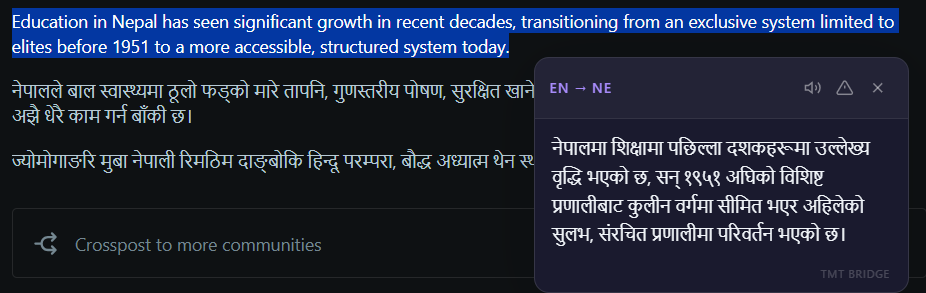
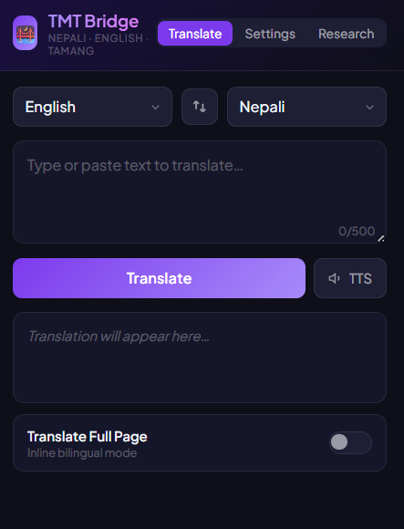
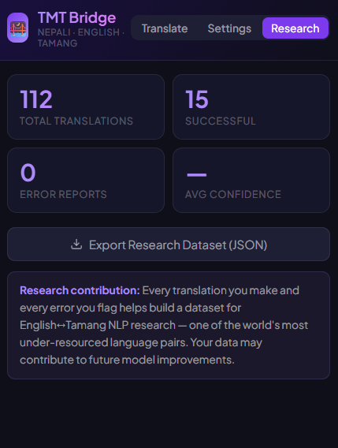
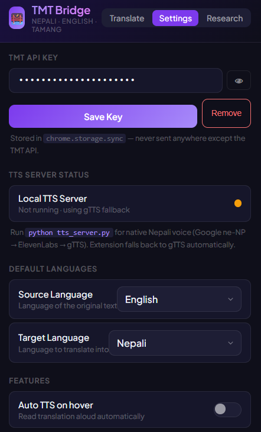

# TMT Bridge — Nepali · English · Tamang

> Real-time translation across all 6 language directions, built for the web — with TTS readback, confidence scoring, and a research-grade error dataset.

🎥 Demo Video: [Watch ParsePilot Demo](https://drive.google.com/file/d/1iCwXR20UIeG9FU4e0d3MIr7jwq-lflk6/view?usp=sharing)

**Built for the Google TMT Hackathon 2026** · Chrome Extension · Manifest V3  

---
## Why this exists

Tamang is spoken by over 1.5 million people in Nepal, but almost no web content exists in Tamang — and most Tamang speakers are more comfortable hearing their language than reading it. TMT Bridge brings the TMT translation API directly into the browser: select any text on any webpage and get an instant translation with audio readback, no copy-pasting required.

Beyond usability, every translation is logged locally and every user-reported error is classified by type — building a structured dataset for low-resource machine translation research.

---

## Screenshots

### Hover-to-translate tooltip
Select any text on any webpage and get an instant Nepali translation inline — no copy-pasting.



### Popup — Translate tab
Type or paste text, choose language direction, and hit Translate. TTS readback is one click away.



### Popup — Research tab
Tracks total translations, successes, error reports, and average confidence score. Export everything as JSON.



### Popup — Settings tab
Enter your TMT API key, check TTS server status, and configure default languages and features.



---

## Features

| | Feature | What it does |
|---|---|---|
| 🖱️ | **Hover-to-translate** | Select any text on any page → tooltip appears instantly with translation |
| 📄 | **Full-page bilingual mode** | Toggle to show original + translation inline, side by side |
| 🔊 | **TTS readback** | Reads translations aloud — critical for oral Tamang speakers |
| ↔️ | **All 6 directions** | EN↔NE, EN↔TMG, NE↔TMG — full coverage |
| 📊 | **Confidence scoring** | Back-translation roundtrip gives a quality score for every result |
| 📚 | **Domain glossary** | Pre-loaded health, education, and government terms for Tamang |
| ⚠️ | **Error reporting** | Users classify bad translations by error type (wrong meaning, wrong script, etc.) |
| 💾 | **Research dataset export** | Export all translation events + error reports as JSON |
| 🖱️ | **Context menu** | Right-click any selection → "Translate with TMT Bridge" |

---

## Getting Started

1. Install the extension
2. Open the popup → go to **Settings**
3. Enter your TMT API key (`team_xxxxxxxxxxxxxxxx`)
4. Start translating

## Installation

### Chrome

1. Go to `chrome://extensions/`
2. Enable **Developer Mode** (toggle, top right)
3. Click **Load unpacked**
4. Select the `tmt-extension/` folder
5. The TMT Bridge icon appears in your toolbar

### Firefox

1. Go to `about:debugging#/runtime/this-firefox`
2. Click **Load Temporary Add-on**
3. Select `manifest.json` from the `tmt-extension/` folder

---

## Setup

### 1. Enter your API key

Open the extension popup → go to the **Settings** tab → paste your TMT team API key:

```
team_xxxxxxxxxxxxxxxx
```

The key is stored in `chrome.storage.sync` — it stays on your device and is never sent anywhere except the TMT API.

### 2. (Optional) Start the TTS server for best Nepali voice quality

The extension works without this — it falls back to Google Translate TTS automatically. But for the best Nepali audio quality (Google Cloud ne-NP voice or ElevenLabs), run the local server:

```bash
cd tts_server/
cp .env.example .env        # then edit .env with your keys
pip install -r requirements.txt
python tts_server.py
```

Or use the startup script:

```bash
# Mac / Linux
bash tts_server/start_tts_server.sh

# Windows
tts_server\start_tts_server.bat
```

The server runs on `http://localhost:7799`. The extension detects it automatically.

**TTS quality priority chain:**
1. Google Cloud TTS — `ne-NP-Standard-A` (best quality, requires `GOOGLE_TTS_API_KEY`)
2. ElevenLabs — `eleven_multilingual_v2` (multilingual, requires `ELEVENLABS_API_KEY`)
3. gTTS via Google Translate — free, no key needed, always works
4. Browser `speechSynthesis` — last resort fallback

---

## Environment variables (TTS server only)

Copy the example file and fill in your keys:

```bash
cp tts_server/.env.example tts_server/.env
```

```env
# tts_server/.env — never commit this file
GOOGLE_TTS_API_KEY=          # Google Cloud TTS key (optional, best quality)
ELEVENLABS_API_KEY=          # ElevenLabs key (optional)
ELEVENLABS_VOICE_ID=XB0fDUnXU5powFXDhCwa   # default: Charlotte (gentle)
```

The server works fine with no keys at all — it falls through to gTTS automatically.

---

## How to use

### Translate selected text
1. Highlight any text on a webpage
2. A tooltip appears with the translation
3. Click **🔊** to hear it read aloud
4. Click **⚠️** to report a bad translation

### Translate in the popup
1. Click the TMT Bridge icon in your toolbar
2. Type or paste text in the input box
3. Press **Translate** or `Ctrl+Enter`

### Right-click menu
Select any text → right-click → **Translate with TMT Bridge**

---

## Research contribution

This extension goes beyond a translation tool. Every interaction generates structured data for low-resource NLP research.

### Error taxonomy
When a user reports a bad translation, they classify it by type:

| Error type | What it means |
|---|---|
| Wrong meaning | The translation conveys incorrect information |
| Missing words | Part of the source text was dropped |
| Wrong script | Transliteration used instead of native script |
| Unnatural phrasing | Grammatically correct but sounds wrong to a native speaker |
| Other | Anything else |

This creates a labelled error dataset tied to specific TMT API outputs — useful for diagnosing systematic failure modes in low-resource MT.

### Confidence scoring
Every translation is back-translated (target → source) and the result is compared to the original using normalised Levenshtein distance. This gives a 0–100% confidence score without needing a reference translation.

### Dataset export
Go to the **Research** tab → click **Export Dataset** → downloads a JSON file with:
- All translation events (text, language pair, confidence score, timestamp)
- All user error reports (error type, original, translation, timestamp)

---

## File structure

```
tmt-extension/
├── manifest.json           # Extension config (Manifest V3)
├── background.js           # Service worker — API calls, caching, confidence scoring
├── content.js              # Page injection — tooltip, bilingual mode, audio playback
├── content.css             # Tooltip and bilingual overlay styles
├── popup.html              # Extension popup UI
├── popup.js                # Popup logic — translate, settings, stats, export
├── icons/
│   ├── icon16.png
│   ├── icon48.png
│   └── icon128.png
├── screenshots/
│   ├── hover-tooltip.png
│   ├── popup-translate.png
│   ├── research-tab.png
│   └── settings-tab.png
└── tts_server/
    ├── tts_server.py       # Local TTS server (Google ne-NP → ElevenLabs → gTTS)
    ├── requirements.txt    # Python dependencies
    ├── .env.example        # Environment variable template (safe to commit)
    ├── start_tts_server.sh # Mac/Linux startup script
    └── start_tts_server.bat# Windows startup script
```

---

## API notes

- **Sentence-level only** — the TMT API translates one sentence at a time. Full-page mode splits text into sentences, translates each, and reassembles.
- **Rate limiting** — a 300ms delay is added every 5 sentences on large pages to stay within API limits.
- **Caching** — translations are cached in memory for the browser session to avoid duplicate API calls.
- **API key storage** — keys are stored in `chrome.storage.sync`, never in source code.

---

## Security

- API keys are stored in `chrome.storage.sync` — local to your browser, never committed to source control.
- The TTS server only accepts connections from `localhost`.
- No user data is sent to any third party beyond the TMT API and your configured TTS provider.
- See `.gitignore` — the `.env` file is excluded from version control.

---

*TMT Bridge — connecting Nepal's languages to the open web.*
